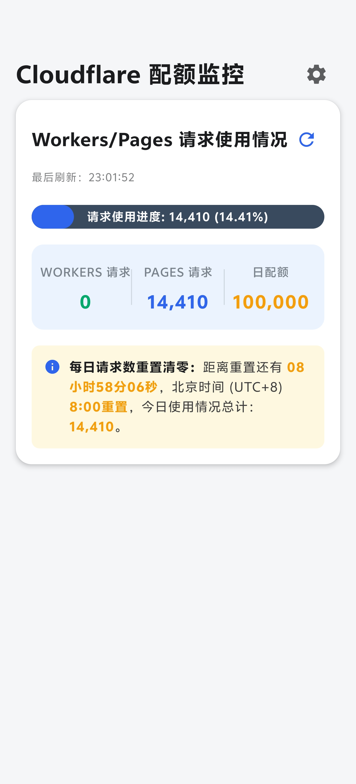
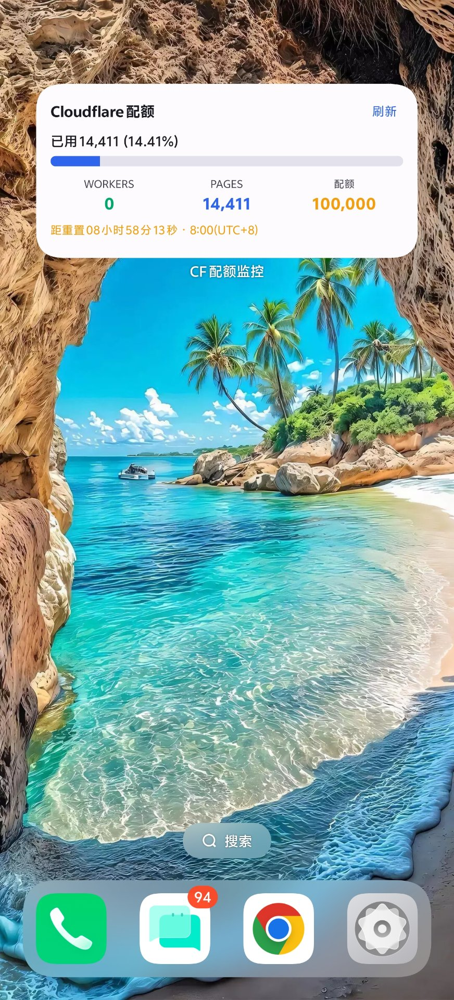
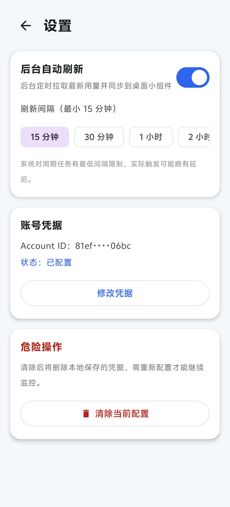

# ⚡ CF Quota Monitor

**一款极简、精准、开源的 Cloudflare Workers 每日配额监控 Android 应用**

实时掌握你的 Workers / Pages 免费额度（100,000 请求/天）消耗情况 —— 精确到 1 次请求。


---

## ✨ 它解决什么问题？

Cloudflare 免费版 Workers 每天有 10 万次请求额度，但官方仪表盘查看起来并不方便，更没有手机端的直观入口。**CF Quota Monitor** 让你：

- 📊 一眼看到今天用了多少、还剩多少、用量百分比
- 🔄 手动一刷即得最新计数 —— 查询策略经过与主流开源方案对齐调优，可做到**精确到 1 的响应**
- ⏰ 清楚知道距离**北京时间 08:00 配额重置**还有多久
- 📱 桌面小组件常驻展示，无需打开 App

## 📸 功能总览

<p align="center">
  
  &nbsp;&nbsp;
  
  &nbsp;&nbsp;
  
</p>

<p align="center">
  <em>应用主界面 · 桌面小组件 · 设置页</em>
</p>

| 功能         | 说明                                                           |
| ---------- | ------------------------------------------------------------ |
| **配额监控主页** | 三列数据面板（已用 / 剩余 / 百分比）+ 胶囊进度条，16dp 圆角卡片设计                     |
| **重置倒计时**  | 米黄色 Banner 实时显示距下次配额重置（北京时间 08:00）的剩余时间                      |
| **极速手动刷新** | 下拉刷新 / 卡片刷新按钮，请求全链路禁用缓存，拿到的永远是 Cloudflare 最新聚合值              |
| **后台自动刷新** | 设置页可开启，支持 15 / 30 / 60 / 120 分钟档位（基于 WorkManager 周期任务）       |
| **桌面小组件**  | Jetpack Glance 实现；点击组件秒开 App，独立刷新按钮带旋转加载态，数据与 App 内严格一致      |
| **请求日志**   | 内置面板展示最近 20 条 API 请求（状态码 / 耗时 / 响应指纹），刷新是否生效一目了然             |
| **安全存储**   | API Token 使用 Android Keystore（AES/GCM）加密后存入 DataStore，绝不明文落盘 |
| **配置管理**   | 设置页一键清除 API 配置，带二次确认弹窗防误触                                    |

## 🚀 快速开始

### 1. 准备 Cloudflare 凭据

- **Account ID**：Cloudflare 仪表盘 → Workers & Pages → 右侧栏可见
- **API Token**：仪表盘 → My Profile → API Tokens → Create Token，授予 **Account Analytics: Read** 权限即可（最小权限原则，请勿使用 Global API Key）

### 2. 安装

从 [Releases](../../releases) 下载最新 APK 安装，或自行编译（见下文）。

> 系统要求：Android 8.0 (API 26) 及以上

### 3. 配置

打开 App → 填入 Account ID 与 API Token → 保存。数据立即拉取，同时可将小组件添加到桌面。

## 🏗️ 技术架构

```
┌─────────────────────────────────────────────┐
│  UI 层    Jetpack Compose (Material 3)      │
│           主页 / 设置页 / 请求日志 / 错误态    │
│           Glance 桌面小组件 (StateFlow 驱动)  │
├─────────────────────────────────────────────┤
│  领域层   UseCases + 纯 Kotlin Model         │
│           MVVM + Clean Architecture          │
├─────────────────────────────────────────────┤
│  数据层   OkHttp 4.12 (零缓存管线)           │
│           Cloudflare GraphQL Analytics API   │
│           DataStore + Keystore AES/GCM 加密  │
├─────────────────────────────────────────────┤
│  后台     WorkManager 2.10 周期刷新           │
└─────────────────────────────────────────────┘
```

**关键技术决策**（踩坑换来的经验，详见提交历史）：

- **纯 OkHttp 而非 Ktor**：Ktor 连接池的死连接会导致刷新"看似成功实则拿旧数据"，改用零缓存（`cache(null)` + `Cache-Control: no-store` + 随机 cache-bust 参数）的 OkHttp 管线后彻底解决
- **GraphQL 查询对齐**：使用 `datetime_geq / datetime_leq` ISO 时间戳过滤 + `limit: 10000`，避免聚合截断，这是精度能到 1 的关键
- **Glance 小组件状态流驱动**：Glance 会话存活期间 `update()` 只触发重组、不重跑取数逻辑，因此用进程级 `MutableStateFlow` 仓库（`WidgetStore`）+ `collectAsState` 订阅，三条刷新链路（组件按钮 / 后台 Worker / App 内刷新）共用同一数据入口
- **WorkManager 强制 2.10.0**：Glance 1.1.1 传递依赖的 2.7.1 在 targetSdk ≥ 34 会因前台服务限制直接闪退

## 🔨 从源码编译

```bash
git clone https://github.com/1258798399-maker/CF-Quota-Monitor.git
cd cf-quota-monitor

# 需要 JDK 17 与 Android SDK (compileSdk 36)
./gradlew assembleRelease
```

产物位于 `app/build/outputs/apk/release/`。首次编译请：

1. 在 `local.properties` 中配置 `sdk.dir=<你的 Android SDK 路径>`
2. 复制 `app/keystore.properties.example` 为 `app/keystore.properties`，填入你自己的 keystore 与密码（详见模板内注释）

未配置 `keystore.properties` 时 Gradle 会自动回退到 debug 签名，产物可装但无法与正式签名版覆盖安装。

## ❓ FAQ

**Q: 数据是实时的吗？**  
A: 数据来自 Cloudflare GraphQL Analytics API。免费档存在约 1–60 秒的批量聚合延迟（Cloudflare 侧行为，所有同类工具一致）。App 端已彻底禁用一切缓存，刷新拿到的永远是 Cloudflare 当前已聚合的最新值。

**Q: 为什么自动刷新最小间隔是 15 分钟？**  
A: 这是 Android WorkManager 周期任务的系统下限。追求即时数据请使用手动刷新，响应在 1 秒内。

**Q: 我的 Token 安全吗？**  
A: Token 仅存储在本机，经 Android Keystore 硬件级 AES/GCM 加密，App 无任何第三方上报。代码完全开源，欢迎审计。

## 📋 版本历程

| 版本      | 亮点                                   |
| ------- | ------------------------------------ |
| 1.6.6   | 小组件"最后刷新"时间内联至"距重置"行，100% 还原 v1.6.2 布局，彻底修复不显示问题 |
| 1.6.5   | 小组件布局压实以容纳"最后刷新"行                  |
| 1.6.4   | 应用升级后强制重绘所有已放置的小组件实例               |
| 1.6.3   | 新增"最后刷新"显示（小组件内，与 App 内一致）           |
| 1.6.2   | 修复网络良好时误报"未找到账户"，保留上次成功数据 + 过期提示    |
| 1.6.1   | 修复小组件刷新按钮（Glance 会话机制陷阱），状态流驱动重构     |
| 1.6.0   | 设置页 + 后台自动刷新 + 小组件点击进 App + 清除配置二次确认 |
| 1.5.x   | 全链路禁缓存、GraphQL 查询精度对齐、排版修复           |
| 1.4.x   | 网络层重写为纯 OkHttp，修复刷新失效与启动闪退           |
| 1.0–1.3 | 初版功能、GraphQL 字段修正、刷新机制打磨             |

## 🤝 贡献

欢迎 Issue 与 PR！如果这个项目帮到了你，点个 ⭐ Star 支持一下。

## 📄 许可证

[MIT License](LICENSE) — 自由使用、修改、分发。

---

\<div align="center">  
\<sub>本项目与 Cloudflare, Inc. 无隶属关系。Cloudflare 是 Cloudflare, Inc. 的注册商标。\</sub>  
\</div>
